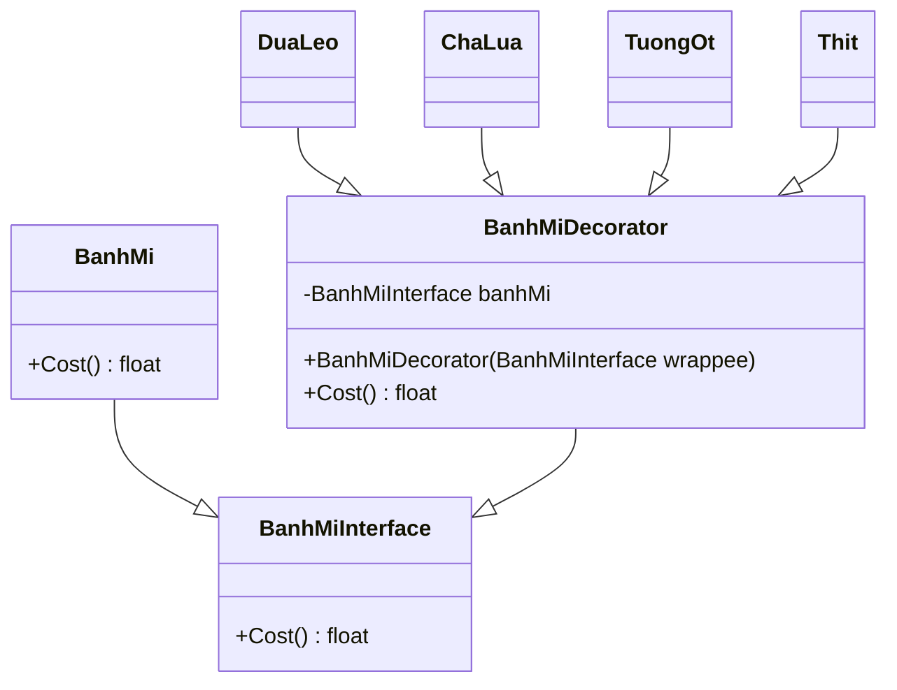

# Decorator design pattern in PHP

This is a simple implementation of the decorator design pattern in PHP.

## Installation and run

## UML diagram


## Usage

```php
$banhMi = new BanhMi();
$banhMi = new DuaLeo($banhMi);
$banhMi = new ChaLua($banhMi);
$banhMi = new TuongOt($banhMi);
$banhMi = new Thit($banhMi);

echo $banhMi->Cost();
```

## Output