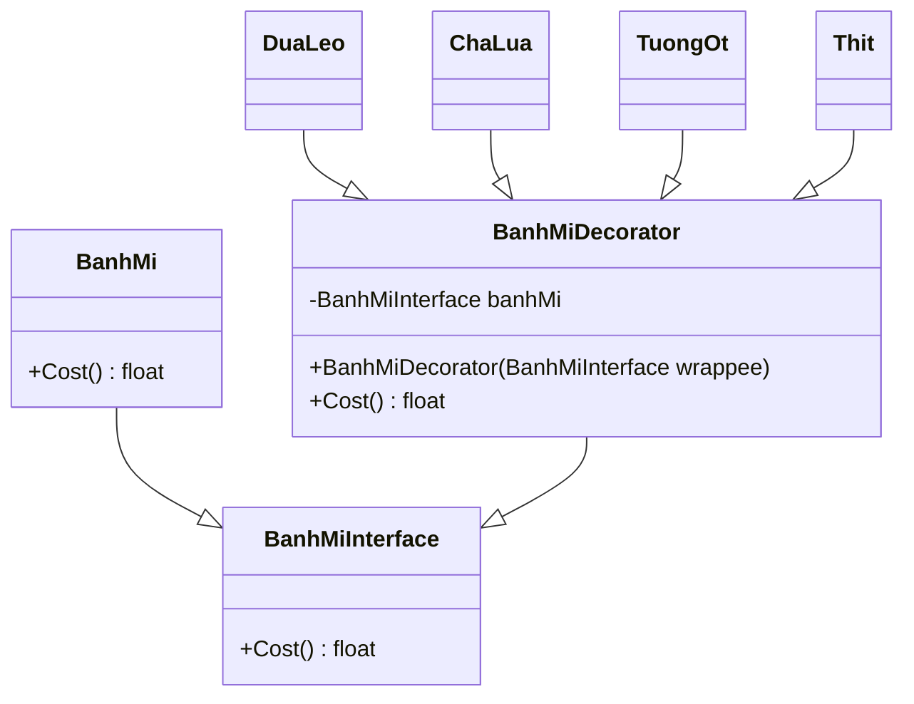

# Decorator design pattern in PHP

This is a simple implementation of the decorator design pattern in PHP.

## Installation and run
1. Clone this repository
2. Run `composer install`
3. Run `php src/main.php`

## UML diagram


## Usage

```php
$firstBanhMi = new Thit(
                new TuongOt(
                    new DuaLeo(
                        new ChaLua(
                            new BanhMi()))));

echo "Cost of first banh mi: " . $firstBanhMi->cost() . " VND" . PHP_EOL;

$secondBanhMi = new Thit(
                    new TuongOt(
                        new DuaLeo(
                            new BanhMi()
                        )
                    )
                );

echo "Cost of second banh mi: " . $secondBanhMi->cost() . " VND" . PHP_EOL;
```

## Output
```bash
Cost of first banh mi: 12000 VND
Cost of second banh mi: 9500 VND
```